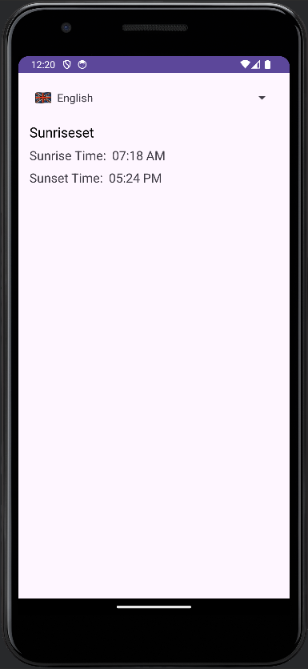
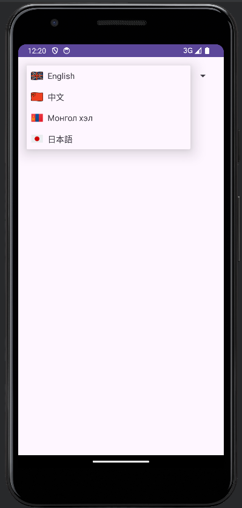
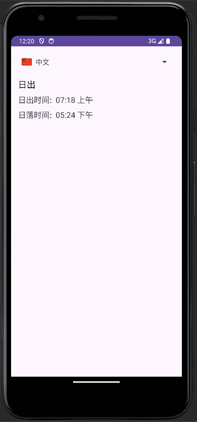
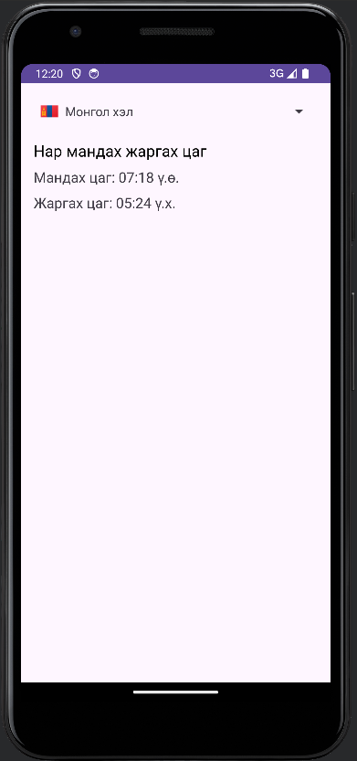
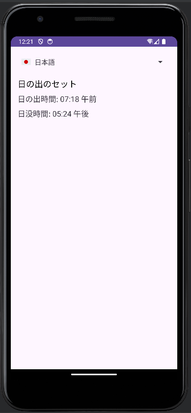

# SunriseSet App

- [SunriseSet App](#sunriseset-app)
  - [Description](#description)
  - [Features](#features)
  - [Screenshots](#screenshots)
  - [Installation](#installation)

## Description

SunriseSet is a mobile application that provides users with the local sunrise and sunset times based on their geographical location. Designed with simplicity in mind, it offers an intuitive user interface and the ability to switch languages dynamically.

## Features

- Displays local sunrise and sunset times.
- Supports dynamic language switching.
- Clean and user-friendly interface.

## Screenshots

## Installation

To install SunriseSet, clone the repository and build the project using Android Studio.
